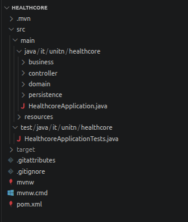

# HealthCore - Healthcare Management System

## Overview

HealthCore is a web-based healthcare management system developed for a small network of hospitals. The system aims to provide a secure and efficient platform that connects patients, doctors, and administrators while ensuring the protection of sensitive medical information.

The project was developed as part of a software engineering course (University of Trento) and follows a layered architecture designed to support maintainability, scalability, and security.


## Project Structure




## Getting Started

### Prerequisites

- Java 11 or higher
- A compatible Java web server (e.g. Apache Tomcat)
- A relational database PostgreSQL
- Maven 

### Setup

1. **Clone the repository**
   ```bash
   git clone https://github.com/theThirtyOnePercent/HealthCore.git
   cd HealthCore
   ```

2. **Configure your database**  
   Update the database connection settings in the application configuration file with your local credentials.

3. **Build the project**
   ```bash
   mvn clean install
   ```
   *(Or import into your IDE and build from there.)*

4. **Deploy**  
   Deploy the generated `.war` file to your web server (e.g. Tomcat's `webapps/` directory).

5. **Access the application**  
   Open your browser and navigate to:
   ```
   http://localhost:8080/healthcore
   ```

---

## Documentation

Code documentation is generated using [Doxygen](https://www.doxygen.nl/). To build the docs locally:

```bash
doxygen Doxyfile
```

The output will be placed in the `docs/` directory. Open `docs/html/index.html` in your browser to browse the full documentation.

---

## Contributing

Contributions are welcome! To get started:

1. Fork the repository.
2. Create a new branch for your feature or fix: `git checkout -b feature/your-feature-name`
3. Commit your changes with clear messages.
4. Open a Pull Request describing what you've changed and why.

Please ensure your code follows the existing style conventions and is documented with Doxygen-compatible comments.

---

## License

This project was developed as part of a Software Engineering (University of Trento) course. 