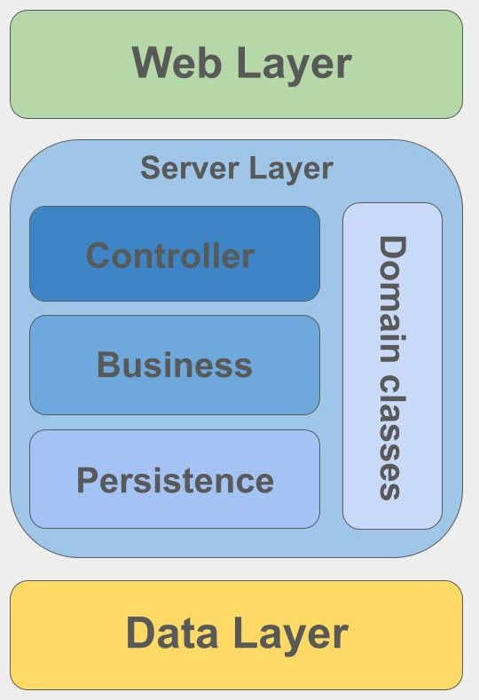

# Architectural Overview

This document details the architectural design of the **HealthCore** hospital management system. The application leverages a highly decoupled, scalable, and maintainable structure by combining a **Layered (N-Tier) Architecture** with the **Model-View-Controller (MVC)** design pattern.

Here is the visual layout of our architecture:

---